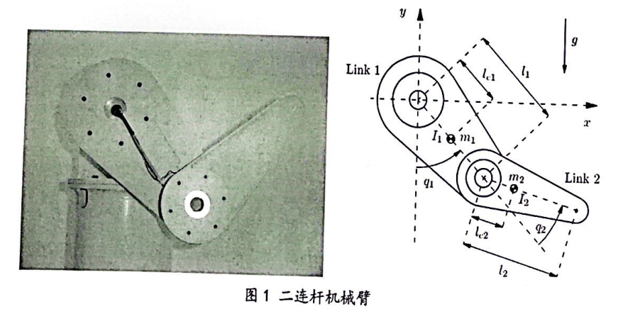

# 现代运动控制作业

## 一、简答题

### 1. 什么是运动控制？简述现代运动控制的发展趋势。
 
 
 
### 2. 一般的商业化电动机伺服驱动器包括哪几种控制模式？在机器人的动力学控制中，选择何种驱动器控制模式以及如何考虑电动机的数学模型
 
 
 
### 3. 现代运动控制中，为什么需要考虑协调控制？简要分析如何将任务目标转化为同步误差。
 
 
  
### 4. 在PTP运动控制中，采用S型速度规划算法，整个运动时间为T，加加速度为J。假设匀速段的运动时间为T/3、其他各段运动时间相同，请画出加速度的曲线并写出加速度的表达式。
 
 
 
## 二、设计题

$l_1$考虑图1中的二连杆机械臂，该机械臂包括两个旋转关节和两个刚性连杆，关节的运动由无刷直流电机及谐波减速器驱动，关节转角由绝对式光电编码器测量。如图1所示，两个连杆的长度分别为$l_1,l_2$，质心为$l_{e1},l_{e2}$，质量为$m_1,m_2$；两个关节的转角为$q_1,q_2$，转动惯量为$I_1,I_2$，驱动力矩为$\tau_1,\tau_2$。请完成机械臂运动控制中的以下设计问题：

### 5. 运用拉格朗日方法，详细推导机械臂的动力学模型；在此基础上，给出增广PD控制律的表达形式，并画出相应的控制系统方框图。
 
 
  
### 6. 在增广PD控制律的基础上，能否理论上提出一种新型的非线性动力学控制率，该控制律能够补偿非线性摩擦力并且减小机械臂系统中的各种扰动和建模误差，画出相应的控制系统方框图。
 
 
 
### 7. 简要给出机械臂的硬件结构组成及运动控制系统的设计过程。
 
 
 
